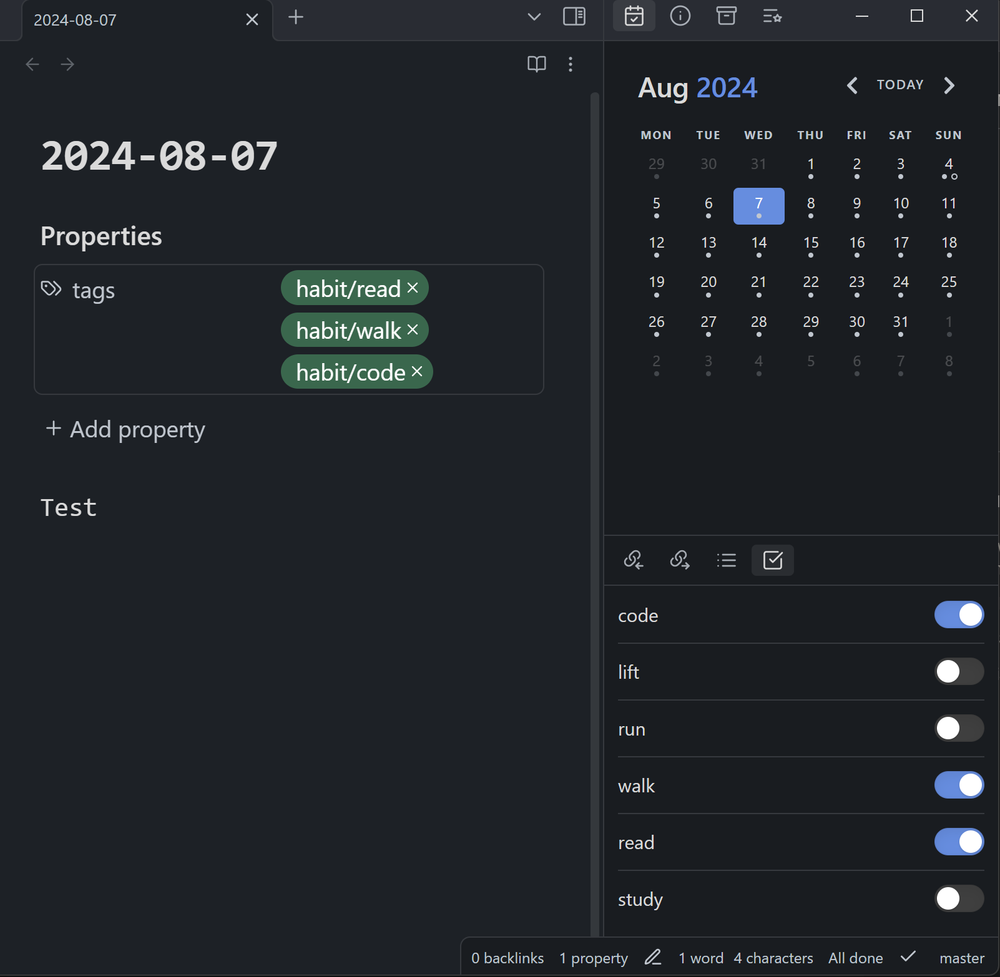
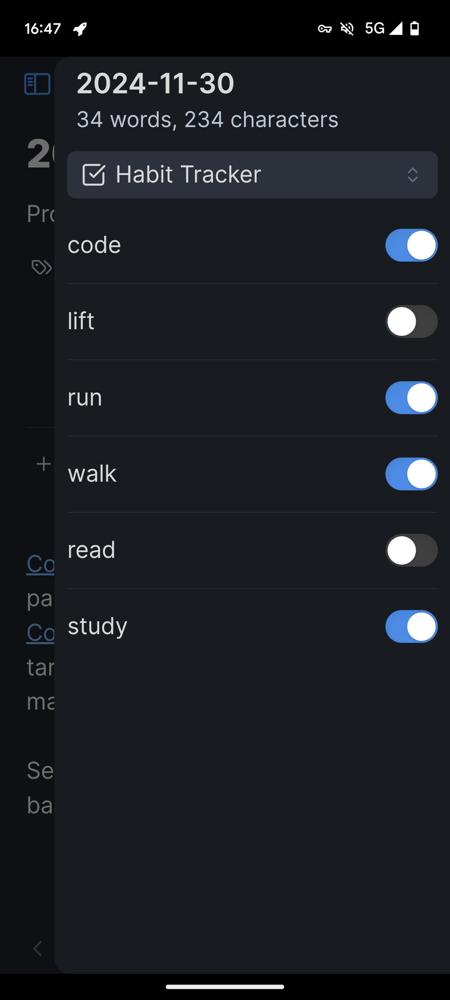

# Kikijiki Habit Tracker Plugin for Obsidian

A simple habit tracker plugin for Obsidian.

## Usage

1. Install the plugin through Obsidian's Community Plugins.
2. Enable the plugin in Settings → Community Plugins.
3. Configure your habits. Each habit will set a tag in the current document with the following name: `prefix/habit`.
4. Use the "Open Habit Panel" command to show the panel and put it somewhere you like.

## Screenshots

    

        
Desktop

        
    

    

        
Mobile

        
    

